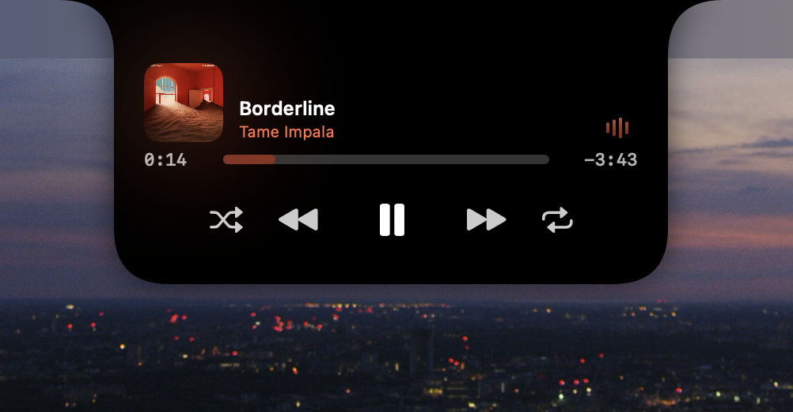

  

<h1 align="center">DynBar for macOS</h1>

  <strong>The MacBook notch, turned into a command surface.</strong> 
  Media, AI usage, system insight, and one-click workflows — right where you already look.

  
  
  
  

  <a href="https://github.com/PlansbyStudio/DynBar-Updates/releases/latest"><strong>⬇︎ Download the latest version</strong></a>

---

DynBar lives in the notch — or a floating bar on Macs without one — and stays out of the way until
you need it. Hover or click and it expands with native animations into whatever you reached for: the
now-playing track, your AI agent's token budget, an export that just finished, or a saved set of apps
that opens exactly where you want them.

  

## Highlights

- **AI & agent dashboard** — live token usage, cost, and quota for **Claude**, **Codex**, and
  **Cursor**, plus which agent sessions are running or waiting for you.
- **Creative export detection** — a live activity when **Premiere Pro**, **Media Encoder**,
  **Lightroom**, or **Photoshop** starts an export, so you can glance at progress from anywhere.
- **Menu-bar workflows** — launch a set of apps, folders, and files with one click, each window
  placed on the display and at the size you choose.
- **Media & live activities** — playback controls with previews, plus Focus, screen recording,
  downloads, and battery/charging indicators.
- **System insight** — CPU, GPU, memory, network, and disk, sampled live.
- **Everyday utilities** — clipboard history, timers, colour picker, calendar previews, a webcam
  mirror, and lock-screen widgets.

  
    
  

## Download & install

1. **[Download the latest release](https://github.com/PlansbyStudio/DynBar-Updates/releases/latest)**
   and unzip it.
2. Move **DynBar.app** into your **Applications** folder.
3. DynBar is signed but not notarised, so macOS blocks the very first launch. **Right-click the app
   → Open** once (or open *System Settings → Privacy & Security* and choose **Open Anyway**). After
   that, it launches normally.
4. Grant the permissions DynBar asks for as you use each feature.

> **Why the extra click?** DynBar isn't distributed through the App Store. The one-time
> right-click → Open is macOS Gatekeeper asking you to confirm an app from outside the store. It's
> only needed the first time.

## Staying up to date

DynBar updates itself automatically. It checks this feed and offers new versions inside the app —
just click **Install** when prompted. You don't need to come back here to update.

Every release is delivered as a signed package, and DynBar verifies that signature before installing,
so updates are tamper-proof even without notarisation.

## Requirements

- **macOS 14 (Sonoma) or later**
- **Apple silicon** Mac
- A notch (14"/16" MacBook Pro) is ideal — DynBar also runs as a floating bar on Macs and external
  displays without one.

## Support

DynBar is made by **[PlansbyStudio](https://plansbystudio.de)**.
Found a bug or have an idea? Open an issue on this repository.

---

<strong>About this repository</strong> (for the curious)

 

This is the **public update feed** for DynBar (the app's source repository is private).

- **`appcast.xml`** is the [Sparkle](https://sparkle-project.org) feed the app polls for updates.
- Each version is published here as a **GitHub Release** with a signed `DynBar-<version>.zip` asset,
  so every user's updater can reach both the feed and the download.
- Releases are produced automatically from the app repo — `appcast.xml` is generated, not
  hand-edited.

  © PlansbyStudio · Released under the GPL v3 license

