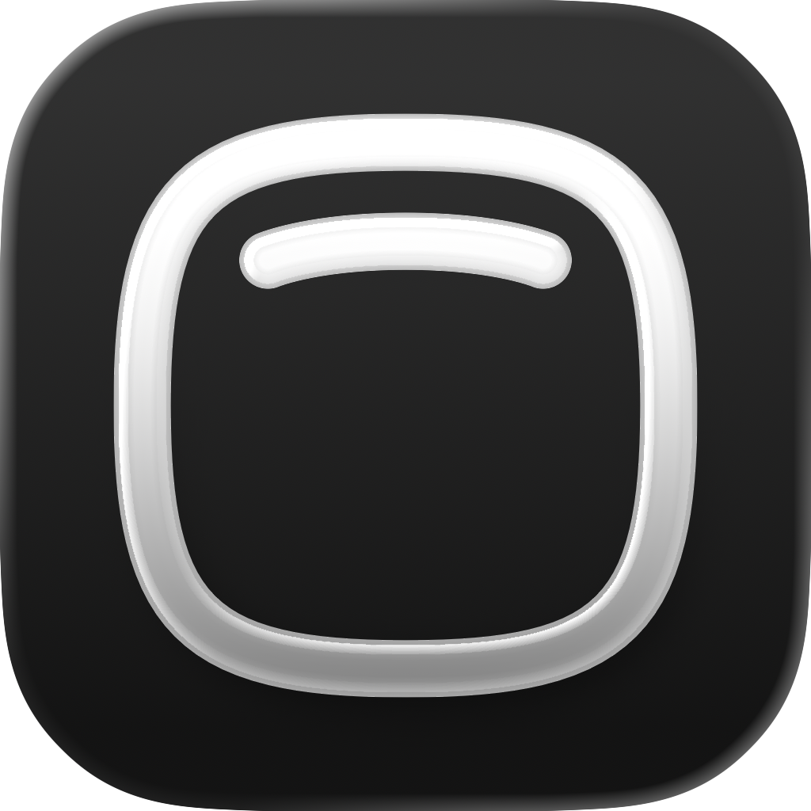
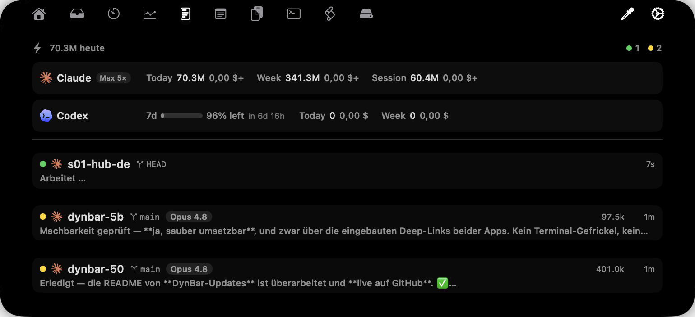
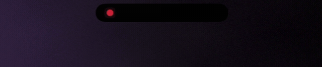
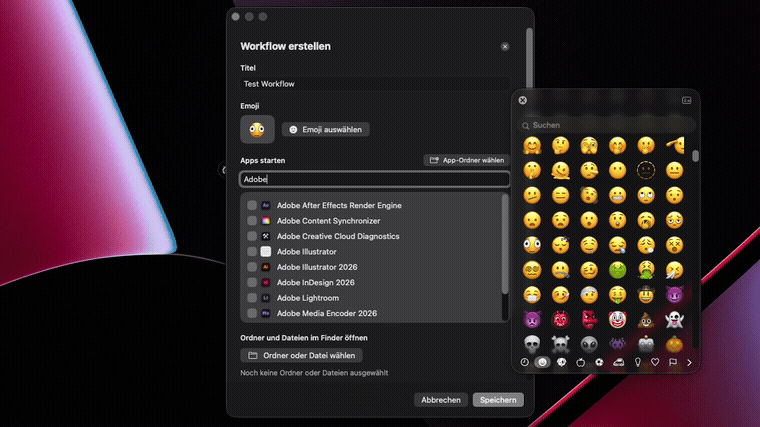
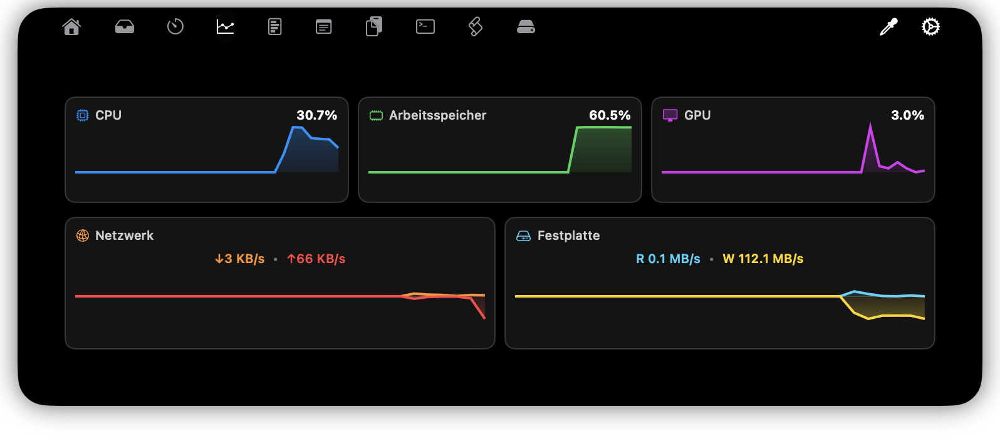
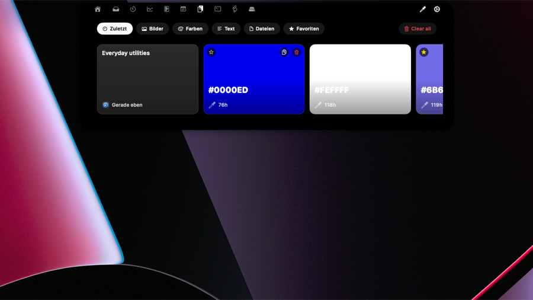
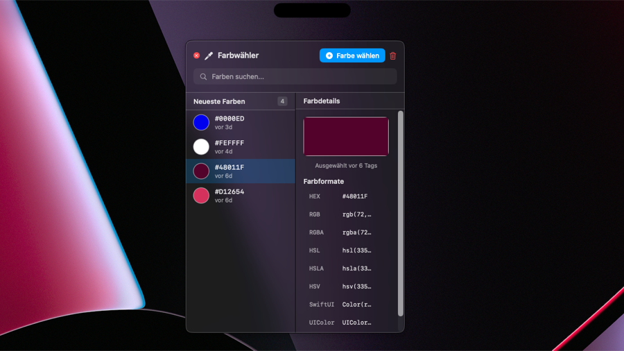
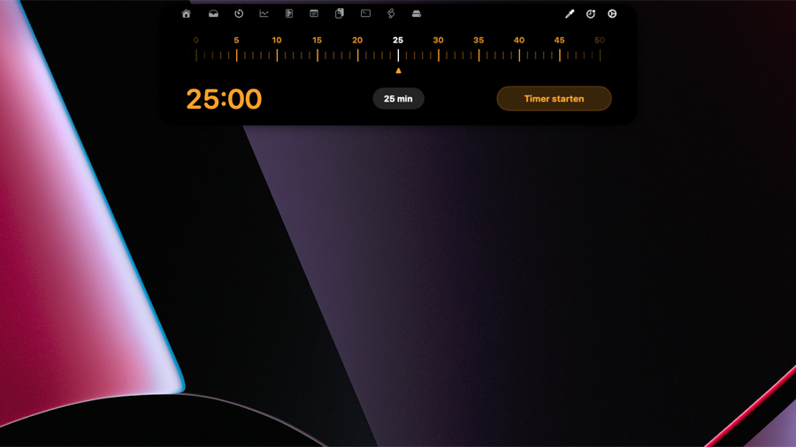
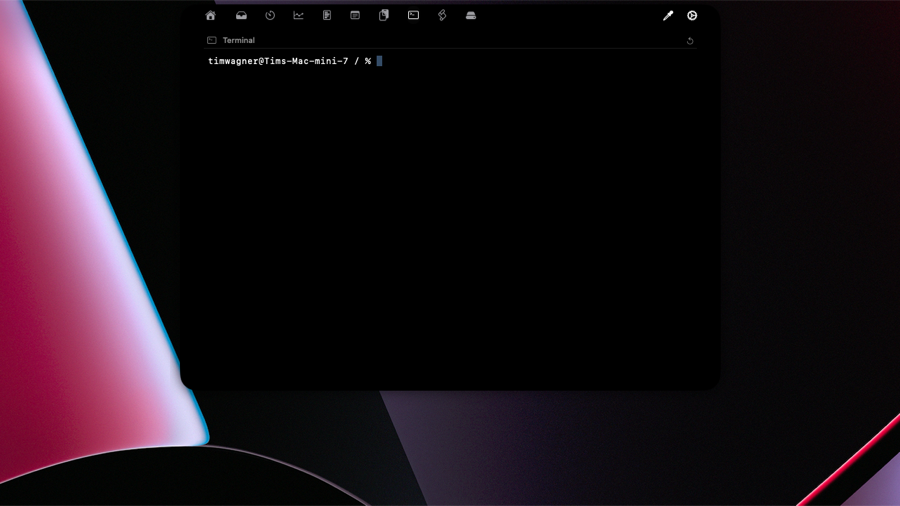

  

<h1 align="center">DynBar für macOS</h1>

  <strong>Deutsch</strong> · <a href="README.en.md">English</a>

  <strong>Die MacBook-Notch, verwandelt in eine Kommandozentrale.</strong> 
  Medien, KI-Agenten-Verbrauch, System-Einblick und Ein-Klick-Workflows — genau dort, wo du ohnehin hinschaust.

  
  
  
  

  
   
  Lädt die signierte <code>.zip</code> aus dem <a href="https://github.com/PlansbyStudio/DynBar-Updates/releases/latest">neuesten GitHub-Release</a>

---

Die meisten Notch-Apps hören bei „läuft gerade“ auf. DynBar hat dort auch angefangen — und ist dann
weitergewachsen, weil die Leute dahinter den ganzen Tag entweder auf einen KI-Coding-Agenten oder auf
einen Render warten. Also wurde die Notch der eine Ort, an dem beides lebt: der Token-Verbrauch deines
Agenten neben dem Fortschrittsbalken deines Exports, einen Klick entfernt von dem, was du eigentlich
gerade gemacht hast.

  
   
  Fahr über die Notch oder klick sie an — sie klappt zu dem auf, wonach du gegriffen hast.

## DynBar ist etwas für dich, wenn du…

- **Claude Code, Codex oder Cursor** nutzt und Token-Verbrauch, Kosten und wartende Sessions sehen
  willst — ohne ins Terminal zu wechseln.
- aus **Premiere Pro, Media Encoder, Lightroom oder Photoshop** exportierst und keine Lust mehr hast,
  einen Fortschrittsbalken in einem versteckten Fenster zu bewachen.
- ein „Standup“- oder „Deep Work“-Fensterlayout hast, das du jeden Morgen von Hand neu aufbaust.
- einfach willst, dass die Notch aufhört, 200px totes Schwarz zu sein.

## Highlights

### KI- & Agenten-Dashboard

Token-Verbrauch, Kosten und Kontingent in Echtzeit für **Claude**, **Codex** und **Cursor**, dazu
welche Sessions laufen oder auf dich warten. Tipp eine Session an, um direkt hineinzuspringen.

  

### Export-Erkennung für Creatives

Eine Live-Aktivität, sobald **Premiere Pro**, **Media Encoder**, **Lightroom** oder **Photoshop**
einen Export startet — so siehst du den Fortschritt von überall auf einen Blick.

  

### Menüleisten-Workflows

Starte eine Reihe von Apps, Ordnern und Dateien mit einem Klick — jedes Fenster auf dem Display und in
der Größe deiner Wahl (Hälften, Viertel, maximiert, zentriert).

  

### Medien & Live-Aktivitäten

Wiedergabesteuerung mit Vorschau, dazu Fokus, Bildschirmaufnahme, Downloads, Akku/Laden — und eine
Kalendervorschau direkt neben dem, was gerade läuft.

  

### System-Einblick

CPU, GPU, Arbeitsspeicher, Netzwerk und Festplatte, live erfasst.

  

### Werkzeuge für den Alltag

Zwischenablage-Verlauf, ein Timer im Lineal-Stil, Farbwähler und ein eingebauter Terminal-Tab — dazu
ein Webcam-Spiegel, Shortcuts zu eingebundenen Volumes und Sperrbildschirm-Widgets für Medien, Timer
und Wetter, während der Mac schläft.

<table>
<tr>
<td width="50%" align="center" valign="top">
   
  <strong>Zwischenablage-Verlauf</strong> — Text, Farben, Bilder und Dateien.
</td>
<td width="50%" align="center" valign="top">
   
  <strong>Farbwähler</strong> — HEX, RGB, HSL, SwiftUI und UIColor auf einen Blick.
</td>
</tr>
<tr>
<td width="50%" align="center" valign="top">
   
  <strong>Timer im Lineal-Stil</strong> — ziehen zum Einstellen, Countdown im Blick.
</td>
<td width="50%" align="center" valign="top">
   
  <strong>Eingebautes Terminal</strong> — eine vollwertige Shell, ohne die Notch zu verlassen.
</td>
</tr>
</table>

### Alles anpassbar

Layouts, Animationen und Hover-Verhalten kannst du frei einstellen. Belege Gesten neu und gib jeder
Aktion — Mediensteuerung, Workflows, Timer — ihren eigenen globalen Tastaturkurzbefehl.

## Download & Installation

1. **[Neuestes Release herunterladen](https://github.com/PlansbyStudio/DynBar-Updates/releases/latest)**
   und entpacken.
2. **DynBar.app** in deinen **Programme**-Ordner verschieben.
3. DynBar ist signiert, aber nicht notarisiert — deshalb blockiert macOS den allerersten Start.
   Einmal **rechtsklicken → Öffnen** (oder *Systemeinstellungen → Datenschutz & Sicherheit* öffnen und
   **Trotzdem öffnen** wählen). Danach startet die App ganz normal.
4. Erteile die Berechtigungen, nach denen DynBar fragt, sobald du die jeweilige Funktion nutzt.

> **Warum der zusätzliche Klick?** DynBar wird nicht über den App Store vertrieben. Das einmalige
> Rechtsklick → Öffnen ist macOS Gatekeeper, der dich bittet, eine App von außerhalb des Stores zu
> bestätigen. Nur beim ersten Mal nötig.

## Immer aktuell bleiben

DynBar aktualisiert sich selbst. Die App prüft diesen Feed und bietet neue Versionen direkt in der App
an — klick einfach auf **Installieren**, wenn du gefragt wirst. Du musst zum Aktualisieren nicht
hierher zurückkommen.

Jedes Release wird als signiertes Paket ausgeliefert, und DynBar prüft diese Signatur vor der
Installation — Updates sind also auch ohne Notarisierung manipulationssicher.

## Voraussetzungen

- **macOS 14 (Sonoma) oder neuer**
- Mac mit **Apple Silicon**
- Eine Notch (14"/16" MacBook Pro) ist ideal — auf Macs und externen Displays ohne Notch läuft DynBar
  auch als schwebende Leiste.

## Support

DynBar kommt von **[PlansbyStudio](https://plansbystudio.de)**.
Fehler gefunden oder eine Idee? Eröffne ein Issue in diesem Repository.

Wenn DynBar dir am Tag einen Klick spart, hilft ein ⭐ auf diesem Repo anderen, es zu finden.

---

<strong>Über dieses Repository</strong> (für Neugierige)

 

Dies ist der **öffentliche Update-Feed** für DynBar (das Quellcode-Repository der App ist privat).

- **`appcast.xml`** ist der [Sparkle](https://sparkle-project.org)-Feed, den die App auf Updates
  abfragt.
- Jede Version wird hier als **GitHub Release** mit einer signierten `DynBar-<version>.zip` als Asset
  veröffentlicht, damit der Updater jedes Nutzers sowohl den Feed als auch den Download erreicht.
- Releases werden automatisch aus dem App-Repository erzeugt — `appcast.xml` wird generiert, nicht von
  Hand bearbeitet.

  © PlansbyStudio · Veröffentlicht unter der GPL-v3-Lizenz

